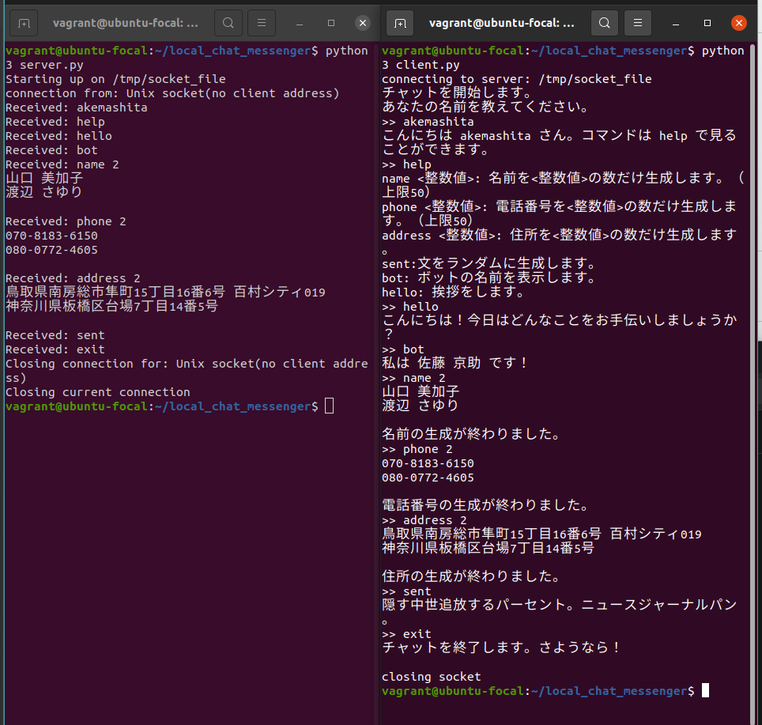

# ダミーデータ生成ボット

このリポジトリは、Python を使用したシンプルなボットアプリケーションです。同一コンピュータ上で動作するサーバとクライアント間で UNIX ソケットを介して通信を行い、以下の機能を提供します。



## 主な機能

- **ダミーデータ生成**
  以下のようなデータを指定された数だけ生成できます。
  - 名前（`name` コマンド）
  - 電話番号（`phone` コマンド）
  - 住所（`address` コマンド）

- **ランダムな日本語の文生成**
  `sent` コマンドでランダムな日本語の文を生成します。


## 動作環境

- Python 3.8 以上
- 必要なパッケージ: `Faker`

---

## 使用方法
1. 次のコマンドで、サーバを起動します。

```
python3 server.py
```

2. 次のコマンドで、クライアントを起動します。

```
python3 client.py
```

3. コマンド一覧
- name <数値>: 指定した数の名前を生成します（1-50）。
- phone <数値>: 指定した数の電話番号を生成します（1-50）。
- address <数値>: 指定した数の住所を生成します（1-50）。
- sent: ランダムな日本語の文を生成します。
- bot: ボットの名前を表示します。
- hello: 挨拶を表示します。
- help: 使用可能なコマンド一覧を表示します。
- exit: チャットを終了します。

## 注意事項
- サーバが起動中であることを確認してください。
- UNIX ソケットを使用しているため、Windows 環境では動作しない場合があります。